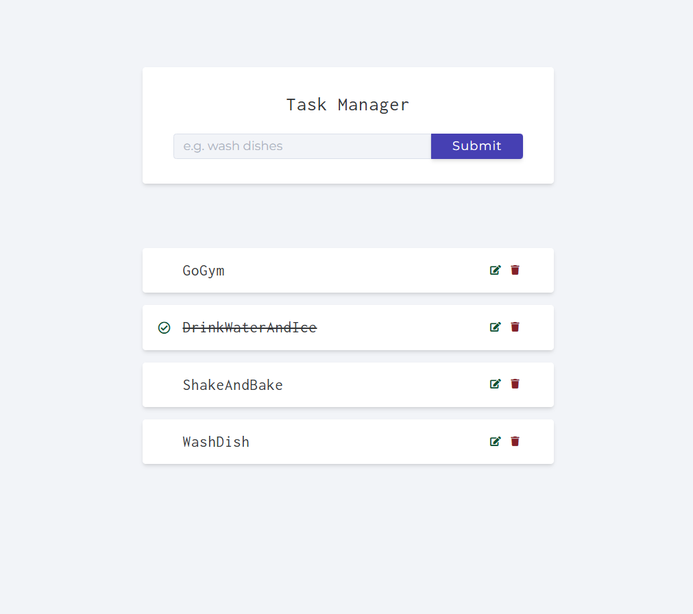

# Task Manager

A simple and intuitive task manager web application that allows users to add, edit, and mark tasks as completed. This application provides a minimalistic interface to manage daily tasks efficiently.

## Features
- **Add Tasks**: Users can input new tasks and add them to the list.
- **Edit Tasks**: Users can modify the task name and mark them as completed.
- **Complete Tasks**: Tasks that are completed are visually crossed out.
- **Delete Tasks**: Users can remove tasks from the list.

## Tech Stack
- **Frontend**: HTML, CSS, JavaScript 
- **Backend**: Node.js with Express
- **Database**: MongoDB with Mongoose for database interaction

## Preview



## Setup Instructions

1. Clone the repository:
   ```bash
   git clone https://github.com/Addysd/Task-Manager.git
   ```
2. Navigate into the project directory:
   ```bash
   cd Task-Manager
   ```
3. Install the required dependencies:
   ```bash
   npm install
   ```
4. Start the application:
   ```bash
   npm start
   ```
5. Visit the application at http://localhost:3000 in your browser.   

